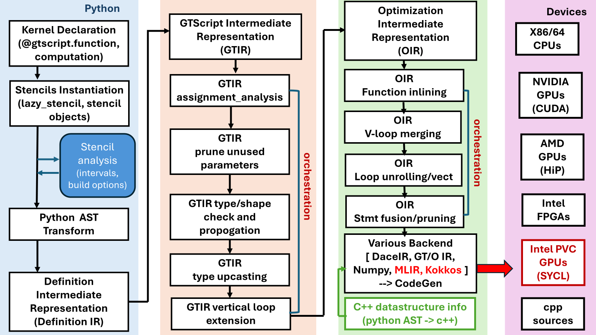

Users Guide
=============

1: Introduction
----------------
Python has became the dominant programming language in machine learning and data sciences community because it is easy to learn and program, however the performance of Python is still the major concern in scientific computing and HPC community. In scientific computing and HPC community, the most widely used programming language is C/C++ and Fortran, Python is often used as script language for pre- and post-processing. Although, many complains about Python program performance happens from time to time, and obviously, Python program community didn't take it for the standard consideration. 

The major performance issues in Python programming language, especially in computation-intensive applications, are loops, which are often the performance bottlenecks of an application in other programming languages, such as C++ and Fortran. In order to achieve peak hardware performance, the scientific computing community have tried different programming model, such as OpenMP, Cilk+, Thread Building Blocks (TBB) as well as Linux p-threads for multi/many-core processors and GPUs, and Kokkos, RAJA, OpenMP offload, and OpenACC for highest performance on CPU/GPUs heterogeneous system.

The Python based NDSL programming model described in this users guide provides an alternative solution to reach peak hardware performance with relatively little programming effort by using the stencil semantics. A stencil is similar to parallel for kernel that used in Kokkos and RAJA, to update array elements according to a fixed access pattern. With this idea in mind, NDSL, for example, can be used to write matrix multiplication kernels that match the performance of cuBLAS that many GPU programmers can’t do in Cuda/HiP using only about 25 lines of code. NDSL has already been used it in Pace global climate model, that are up to 4x more efficient than the original Fortran implementations. 

2: Programming model
----------------------------------------------------
The programming model of NDSL is composed of Execution Spaces, Execution Patterns, Execution Policies, Memory Spaces, Memory Layout and Memory Traits. These abstraction concepts allow the formulation of generic algorithms and data structures which can then be mapped to different types of architectures. Effectively, they allow for compile time transformation of algorithms to allow for adaptions of varying degrees of hardware parallelism as well as of the memory hierarchy.

.. 1:

   The High-level architecture of NDSL.

