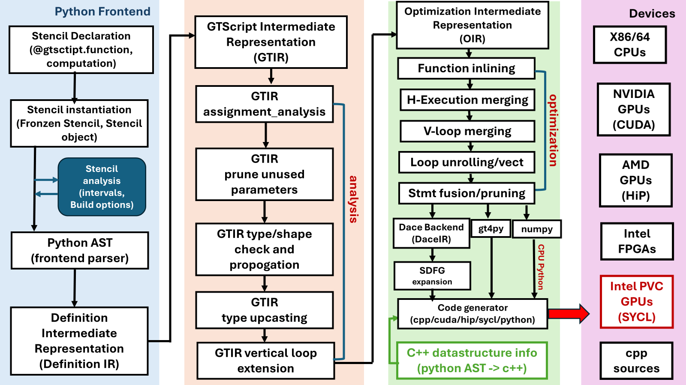

Users Guide
=============

1: Introduction
----------------
Recently, Python has became the dominant programming language in machine learning and data sciences community since it is easy to learn and program, however the performance of Python is still the major concern in scientific computing and HPC community. In scientific computing and HPC community, the most widely used programming language is C/C++ and Fortran, Python is often used as script language for pre- and post-processing. Although, many complains about Python program performance happened from time to time, and obviously, Python program community didn't take it seriously for the language standard consideration. 

The major performance issue in Python programming language, especially in computation-intensive applications, are loops, which are often the performance bottlenecks of an application in other programming languages too, such as C++ and Fortran. However, Python program often observes 10x to 100x slower than C, C++ and Fortran program. In order to achieve peak hardware performance, the scientific computing community have tried different programming model, such as OpenMP, Cilk+, Thread Building Blocks (TBB) as well as Linux p-threads for multi/many-core processors and GPUs, and Kokkos, RAJA, OpenMP offload, and OpenACC for highest performance on CPU/GPUs heterogeneous system, all these programming models are only available for C, C++ and Fortran. Only a few works that targets to high perfromance for Python programming language.

The Python based NDSL programming model described in this users guide provides an alternative solution to reach peak hardware performance with relatively little programming effort by using the stencil semantics. A stencil is similar to parallel for kernel that used in Kokkos and RAJA, to update array elements according to a fixed access pattern. With the stencil semantics in mind, NDSL, for example, can be used to write matrix multiplication kernels that match the performance of cuBLAS/hipBLAS that many GPU programmers can’t do in Cuda/HiP using only about 30 lines of code. NDSL has already been used in Pace global climate model, which achieves up to 4x speedup, more efficient than the original Fortran implementations. 

2: Programming model
----------------------------------------------------
The programming model of NDSL is composed of backend execution Spaces, optimization pass and transformations, and memory spaces, memory layout. These abstraction semantics allow the formulation of generic algorithms and data structures which can then be mapped to different types of hardware architectures. Effectively, they allow for compile time transformation of algorithms to allow for adaptions of varying degrees of hardware parallelism as well as of the memory hierarchy. Figure 1 shows the high level architecture of NDSL, the AST visitor (the NDSL/external/gt4py/src/gt4py/cartesian/frontend/gtscript_frontend.py) IRMaker class traverses the AST of a python function decorated by @gtscript.function and stencil objects, and generates the corresponding definition IR.

.. 1:

   The High-level architecture of NDSL.

The original Python AST of the program is then transform to the Definition IR, the definition IR is high level IR, and composed of high level program information, domain-specific information, and the structure of computational operations. It allows to transform the IR while avoiding the performance
cliffs of numerical libraries. Particularly, transformations preserve the ability to lower operations to hardware instructions implementing coarse-grained vector operations, or to numerical libraries — such as cuBLAS/hipBLAS and Intel MKL. 

The definition IR is then transformed to GTIR, with wich the analysis is performed to remove the redunant nodes, and prunning the unused parameters, and data type and shape propogations of the symbols, and loop extensions. 

Code generation approaches for numerical computing have traditionally focused on optimizing the performance of loop nests. Associated analyses focus on scalar elements as the body of a loop nest typically computes a single element. Such analyses must consider memory dependences and
aliasing. These approaches have been deeply researched in the past [1] and have reached a high 4 Vasilache et al. level of maturity. They are well-suited when starting from an input language like C or Fortran where the problem is already specified in terms of loops over data residing in pre-allocated memory.
When focusing on a specific domain (e.g. the ML space), we have the luxury of programs defined at a much higher level of abstraction than loops. This opens up the opportunity to revisit classical loop optimizations like fusion, tiling or vectorization without the need for complicated analysis
and heuristics. Advantages include reduced complexity and maintenance cost while also scaling naturally to extensions like sparse tensors, that are even more difficult to analyze at the loop level. It makes it possible to avoid raising information from lower level representations by means
of static analysis, where feasible, and performing optimizations at the highest possible level of abstraction. We refer to this approach as structured code generation since the compiler primarily leverages structural information readily available in the source code. Figure 1 shows a coarse-grained
summary structure of the steps and levels of abstraction involved. The starting point (Structured IR) is composed of tensor algebra operations, organized as a functional program over dense and sparse tensors.

